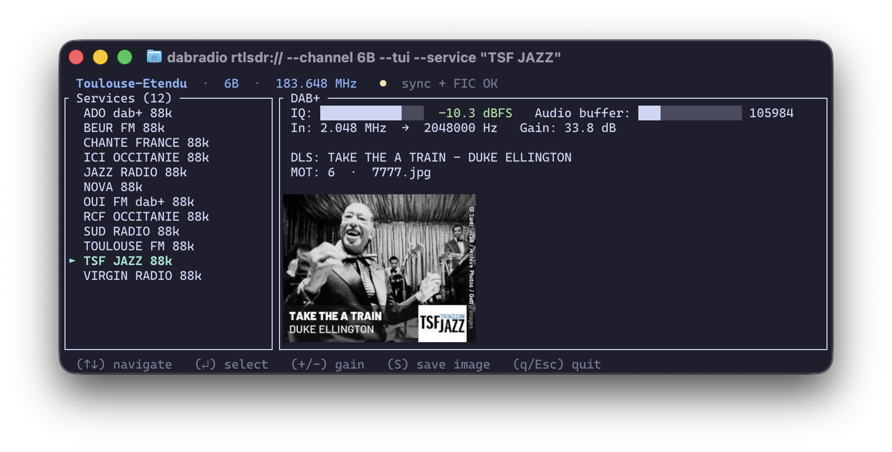

# dabradio — DAB/DAB+ Digital Radio Decoder

A high-performance, production-ready decoder for DAB (Digital Audio Broadcasting) and DAB+ signals. Reads IQ samples from files or SDRs and decodes ensemble information, service listings, and audio streams in real-time.



## Features

- **Full DAB/DAB+ decoding pipeline** — OFDM sync, FIC/MSC extraction, Viterbi FEC, AAC audio
- **Multi-service support** — List all available services or decode a specific one
- **Robust synchronization** — Handles frame alignment drift due to dropped samples or clock errors
- **DAB+ audio output** — AAC-LC and HE-AAC v2 decoding via fdk-aac, 48 kHz stereo output
- **Programme Associated Data (PAD)** — Extract DLS text metadata and MOT slideshow images
  - **DLS (Dynamic Label Segment)**: Song titles, artist names, and text metadata
  - **MOT (Multimedia Object Transfer)**: Album art and slideshow images (JPEG/PNG)
- **JSON output** — Service listings as JSON for programmatic access
- **Packet-mode data** — FIG 0/3, 0/8, 0/13; MSC packet reassembly; TPEG/TEC GeoJSON when UAtype 0x004 is signalled
- **Multiple input formats** — cu8, cs8, cs16, cf32 IQ samples from files or network streams
- **Real-time audio playback** — Streams decoded audio directly to soundcard via tinyaudio
- **Cross-platform** — Tested on Linux x86_64 and macOS Apple Silicon

## Building

```bash
# From the desperado workspace root:
cargo build --release -p dabradio

# RTL-SDR, Airspy, and HackRF are enabled by default.
# Add SoapySDR explicitly when needed:
cargo build --release -p dabradio --features soapy
```

The binary will be at `target/release/dabradio`.

## Usage

### List all services in a DAB ensemble

```bash
# cu8 format (RTL-SDR raw samples)
./target/release/dabradio recording.cu8 --channel 12A

# cf32 format (gqrx raw complex float)
./target/release/dabradio recording.cf32 --channel 12A --format cf32

# cs16 format (signed 16-bit I/Q)
./target/release/dabradio recording.cs16 --channel 12A --format cs16
```

Output:

```
Ensemble: Métropolitain 2 (EId: 0xF044)

Services:
SId      Label                SubCh  Bitrate    Protection
------------------------------------------------------------
0xF201   FRANCE INTER         8      88 kbps    EEP 3-A
0xF202   FRANCE CULTURE       10     88 kbps    EEP 3-A
...
```

### Decode audio from a specific service

```bash
# Play audio from "FRANCE CULTURE" to soundcard
./target/release/dabradio recording.cu8 --channel 12A --service "FRANCE CULTURE"

# Decode by hex SId instead of label
./target/release/dabradio recording.cu8 --channel 12A --service 0xF202

# Save raw DAB+ frames to file (no audio output)
./target/release/dabradio recording.cu8 --channel 12A --service "FRANCE CULTURE" \
  --output frames.bin --no-audio
```

### Live SDR sources (Phase 6)

```bash
# RTL-SDR (build with --features rtlsdr)
./target/release/dabradio rtlsdr:// --channel 12A --service "FIP"

# SoapySDR (build with --features soapy)
./target/release/dabradio soapy://driver=rtlsdr --channel 12A --service "FIP"

# Airspy (build with --features airspy)
./target/release/dabradio airspy://0 --channel 12A --service "FIP"
```

If `freq`/`rate` are not provided in the URI query, `dabradio` injects them from `--channel`/`--freq` and the DAB sample rate (2.048 MHz, or 4.096 MHz for Airspy before 2:1 resampling). Gain follows desperado's shared SDR settings: omitted gain means the DAB default is injected (`rtlsdr`: 29.7 dB, `airspy`: 40 with `gain_mode=linearity`, `hackrf`: 72 plus `amp=true`), while `gain=auto` explicitly requests device automatic gain control where supported.

### Output formats

```bash
# JSON service listing
./target/release/dabradio recording.cu8 --channel 12A --json

# Limit frame processing (useful for testing)
./target/release/dabradio recording.cu8 --channel 12A --max-frames 100
```

### Extract DLS Metadata and MOT Slideshow Images

```bash
# DLS text metadata is printed while decoding a service
./target/release/dabradio recording.cu8 --channel 12A --service "FIP"

# Extract MOT slideshow images to directory (album art, cover art, etc.)
./target/release/dabradio recording.cu8 --channel 12A --service "FIP" \
  --slideshow /tmp/fip_slides

# Extract images without audio playback
./target/release/dabradio recording.cu8 --channel 12A --service "FIP" \
  --slideshow /tmp/fip_slides --no-audio
```

**Output example:**

```
$ ls -lah /tmp/fip_slides/
-rw-r--r-- 1 user user 14279 slide_001.jpg  (JPEG 320×240)
-rw-r--r-- 1 user user 14279 slide_002.jpg  (JPEG 320×240)
-rw-r--r-- 1 user user 17639 slide_003.jpg  (JPEG 320×240)
-rw-r--r-- 1 user user  5416 slide_004.png  (PNG 320×240)
```

## Command-line Reference

```
USAGE:
    dabradio <SOURCE> --channel <CHANNEL> [OPTIONS]

ARGUMENTS:
    <SOURCE>    File path or SDR URI (rtlsdr://, soapy://, airspy://)

OPTIONS:
    --channel <CHANNEL>
            DAB channel (e.g., "12A", "12C")

    -f, --freq <FREQ>
            Center frequency in Hz (alternative to --channel)

    --format <FORMAT>
            IQ format for file sources: cu8, cs8, cs16, cf32 [default: cu8]

    --list
            List services and exit (no audio decoding)

    --json
            Output as JSON

    --service <SERVICE>
            Service to decode (label or hex SId like "0xF201")

    -o, --output <OUTPUT>
            Output file for raw DAB+ logical frames

    --no-audio
            Disable audio output to soundcard

    --slideshow <DIR>
            Extract MOT slideshow images to directory

    --max-frames <MAX_FRAMES>
            Maximum number of OFDM frames to process [default: 0 = unlimited]

    --bypass-deinterleave
            Debug: skip time de-interleaving in MSC (testing only)

    --dump-fic
            Dump parsed FIG 0/0–0/3, 0/8, 0/13, 0/18, 0/19 as JSON after the full input
            (accumulates across the whole run; use without --max-frames for a
            complete FIG 0/13 sweep)

    --dump-packets
            Decode packet-mode MSC subchannels and print CRC stats as JSON

    --traffic
            Decode TPEG/TEC (FIG 0/13 UAtype 0x004) and emit GeoJSON

    --announcements
            Emit FIG 0/18/0/19 announcement events (bearer dab-announcement)

    --location-tables <PATH>
            Optional TMC/GLR location table (CSV or directory with points.csv)

    -h, --help
            Print help information
```

### Packet-mode data and TPEG/TEC

FIG 0/3, FIG 0/8, and FIG 0/13 are parsed so packet-mode components can be
resolved to a SubChId and packet address. TPEG is only treated as confirmed
when FIG 0/13 signals user-application type `0x004`. Conditional-access
components are reported and skipped; they are not descrambled.

Packet-mode FEC (EN 300 401 §5.3.5, RS(204,188), FEC packets at address 1022)
is applied automatically when those packets are seen. Without it, FEC-protected
muxes show inflated CRC rates on address-0 padding and never reassemble
target-address data groups.

A short NRK Riks (channel 12D) cf32 clip is checked in under
`crates/dabradio/tests/data/nrk_riks_12d_short.cf32.iq` (~1.25 s at 2.048 MS/s)
for FIC lock and FIG dumps without a multi-GB capture.

**GQRX wideband Belgian capture** (not in git; ~695 MiB zstd cf32, centre
220.936 MHz, 16 MS/s, SHA-256 `7515b924…f3f9f2`):

```bash
zstd -dc gqrx_….raw.zst | dabradio - --channel 12A --format cf32 \
  --sample-rate 16000000 --center-freq 220936000 --no-audio \
  --dump-fic --dump-packets --traffic --announcements
```

On 12A (`DAB+ VRT`) this confirms FIG 0/13 `UAtype 0x004` (TPEG, SubCh 0,
addr 1) and live FIG 0/18/0/19 road-traffic announcements. The TPEG
subchannel’s FEC frames decode cleanly but carry only address-0 padding in
this clip (`groups_complete=0`). On 12B (`DAB Bruxelles`) the same FEC path
yields strong packet CRC (~99.8%) and completed EPG/SPI data groups.
Artifacts: `IQ-files/gqrx_be_validation/`.

NRK Riks (12D) and Innland (13E) full sweeps confirmed FIG 0/13 has no
`UAtype 0x004`. A 2017 Belgian RTBF DAB (12B) cu8 sample from
[dab-cmdline#27](https://github.com/JvanKatwijk/dab-cmdline/issues/27)
(`IQ-files/be_12b_20171226.iq`, results in `IQ-files/be_12b_validation/`)
does carry `UAtype 0x004` on service `TPEG_PACKET` / SId `0xE0606361`
(SubCh 14, packet address 1, 16 kbps EEP 3-A). That is confirmed by both
`dabradio --dump-fic` and `welle-cli` `dump.fic` with matching 12-service
lists. MSC packet CRC on that TPEG subchannel is above chance (~3.4% after
state-0 Viterbi; ~5.9% with a small sample-rate ppm tweak) but far below the
~84–91% seen on RIKS/Innland EPG components of the same EEP family. Welch
spectrum shows no DC spike; `cu8` centering and `--center-freq` NCO mix are
verified. FIC FIB success on this clip peaks around ~80% vs ~99.9% on the
cf32 captures, so the remaining gap looks like soft-bit/OFDM quality on the
2017 RTL sample rather than a puncturing-table bug. `--traffic` is still an
empty FeatureCollection on that older clip — transport/TEC e2e is not yet
proven on real TPEG bytes.

```bash
# Inspect FIC (ensemble, packet components, user applications)
./target/release/dabradio crates/dabradio/tests/data/nrk_riks_12d_short.cf32.iq \
  --channel 12D --format cf32 --dump-fic --max-frames 40

# Belgian 12B cu8 sample (needs +12 kHz capture-center correction on this file)
./target/release/dabradio IQ-files/be_12b_20171226.iq \
  --channel 12B --format cu8 --sample-rate 2048000 --center-freq 225660000 \
  --dump-fic --no-audio

# Validate packet-mode MSC (CRC pass rate; chance-level means decode is wrong)
# Needs a longer capture than the short fixture; use your own IQ file:
./target/release/dabradio recording.cf32.iq --channel 12D --format cf32 --dump-packets --max-frames 200

# TPEG/TEC GeoJSON when a TPEG component is present
./target/release/dabradio recording.cf32.iq --channel 12D --format cf32 --traffic
```

### Traffic announcements (FIG 0/18 / 0/19)

NRK-style traffic announcements are audio-side stream switching, not packet-mode
TPEG. `--announcements` emits `AnnouncementEvent` JSON lines
(`bearer: dab-announcement`) when FIG 0/19 indicates an active cluster.
Use a longer Innland/13E capture when available:

```bash
./target/release/dabradio recording.cf32.iq --channel 13E --format cf32 \
  --dump-fic --announcements
```

`--dump-fic` also reports per-service FIG 0/18 support bitmaps when present.


# Run all tests
cargo test -p dabradio

# Run tests with output
cargo test -p dabradio -- --nocapture

# Check for clippy warnings
cargo clippy -p dabradio --tests

# Build with optimizations
cargo build --release -p dabradio
```

All 45 unit tests pass (2 require external test fixtures and are ignored). 0 clippy warnings.

## IQ Format Support

### cu8 (Unsigned 8-bit I/Q) — Default

Used by RTL-SDR and most software radios.

```
Bytes per sample: 2 (I byte, Q byte)
Value range: 0-255 → normalized to [-1, +1]
Conversion: (byte - 127.5) / 128.0
```

### cf32 (Complex 32-bit float)

Used by gqrx, USRP, and advanced SDRs.

```
Bytes per sample: 8 (I float, Q float)
Value range: as-is (typically [-1, +1])
Conversion: direct from IEEE 754 f32 bytes
```

### cs8, cs16

Signed 8-bit and 16-bit I/Q formats. Specify with `--format cs8` or `--format cs16`.

## Supported DAB Channels

Use `--channel` with standard designations (150-240 MHz band):

```
5A, 5B, 5C, 5D (174.928-181.936 MHz)
6A, 6B, 6C, 6D (181.936-188.944 MHz)
7A, 7B, 7C, 7D (188.944-195.952 MHz)
8A, 8B, 8C, 8D (195.952-202.960 MHz)
9A, 9B, 9C, 9D (202.960-209.968 MHz)
10A, 10B, 10C, 10D (209.968-216.976 MHz)
11A, 11B, 11C, 11D (216.976-223.984 MHz)
12A, 12B, 12C, 12D (223.984-230.992 MHz)
13A, 13B, 13C, 13D (230.992-238.000 MHz)
```

Or specify frequency directly with `--freq 223936000` (Hz).

## Sample Rate

DAB uses 2.048 MHz sample rate. Ensure your recordings are at exactly 2048000 samples/sec.

## Known Issues & Limitations

1. **MSC decoding requires complete FIC** — services can only be decoded after ensemble info is available (typically 1-2 seconds)
2. **Single service at a time** — use `--service` to select one service; multiplexing not yet supported
3. **Soundcard output on Mac** — requires audio device permissions via system settings

## Debugging

Enable trace-level logging to see frequency estimation and synchronization details:

```bash
RUST_LOG=trace ./target/release/dabradio recording.cu8 --channel 12A --max-frames 5
```

Key debug output:

- `PRS correlation failed, re-acquiring sync` — frame alignment recovery in progress
- `DAB+ audio configured` — audio pipeline ready
- `Fire code sync acquired` — superframe boundary found

## Dependencies

Core:

- **rustfft** — FFT for OFDM processing
- **fdk-aac** — AAC audio decoding
- **reed-solomon** — Forward error correction
- **tinyaudio** — Cross-platform audio output

Utilities:

- **clap** — command-line parsing
- **serde/serde_json** — JSON output
- **tracing** — structured logging
- **crossbeam-channel** — lock-free audio buffering

## References

- [ETSI EN 300 401 v2.2.1](https://www.etsi.org/deliver/etsi_en/300400_300499/300401/02.02.01_60/en_300401v020201p.pdf) — DAB specification
- [welle.io](https://github.com/alanthird/DABstar) — reference decoder architecture
- [FDK-AAC](https://github.com/mstorsjo/fdk-aac) — AAC decoder library

## Contributing

Contributions welcome! Areas for enhancement:

- [ ] Multiplex multiple services in a single run
- [ ] Real-time recording from SDRs
- [ ] TII (Transmitter Identification Information) decoder for SFN detection
- [ ] WebAssembly/browser decoder
- [ ] Ensemble metadata export (RSID/PI-code)
- [ ] JSON output for metadata and MOT images
